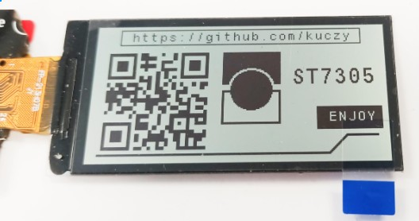
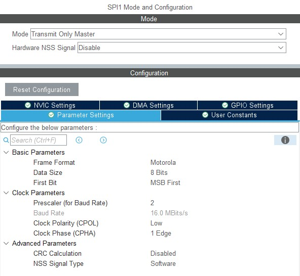
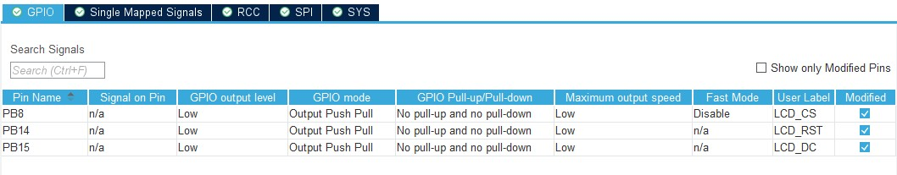

# ST7305-YDP213H001-V3---STM32-HAL-SPI-Driver
YDP213H001-V3 monochrome display controller (reflective, no backlight) on an SPI controller: ST7305 chip
The controller is provided “as is.”
It enables STM32 microprocessors to interface with the YDP213H001-V3 display.



Functions:
- Controller initialization,
- Clearing the image buffer in the ST7305 chip,
- Filling the screen with white,
- Filling the screen with black,
- Rotating the screen by 0, 90, 180, or 270 degrees,
- Displaying text (I used the font file from the SSD1306),
- Displaying bitmaps from an external file containing a bitmap array,
- Displaying shapes: straight line, transparent rectangle, white-filled rectangle, black-filled rectangle, transparent circle, white-filled circle, black-filled circle.

I wrote the driver so that after each transmission, the display enters sleep mode and wakes up only during data transfer—which should help conserve power.
I implemented screen refresh using partial refresh, which also helps with data transfer speed.

-----------------------------------------------------------------------------------------------------------------------------
Usage: IMPORTANT: In the st7305.h file, change #include to your microprocessor type:
```
#include "stm32l0xx_hal.h" /* change to match your STM32 family, e.g. stm32l4xx_hal.h */
```

SPI Configuration:
You can use the configuration shown here—I used SPI1.
The pin names don't matter for SPI:



GPIO Configuration:
Add GPIO pins to your project—you don't have to follow the standard pin naming convention—the port and pin names are specified when the controller is initialized. Here's how it looks in my code:



Implementation in the main.c file:
```
/* USER CODE BEGIN Includes */
#include <stdio.h>
#include "st7305.h"         // ST7305 chip driver file
#include "st7305_font.h"    // Font support file
#include "st7305_paint.h"   // Drawing functions support file
#include "images.h"         // File containing graphics in the form of bitmaps
/* USER CODE END Includes */
```

```
/* USER CODE BEGIN PV */
static st7305_t lcd;         // The name of the display instance we will be referring to
/* USER CODE END PV */
```

```
/* USER CODE BEGIN 2 */
	ST7305_Init(&lcd, &hspi1,					 // Reference to the instance name and specification of the SPI for communication
	            LCD_CS_GPIO_Port,  LCD_CS_Pin,   // Enter the names of the GPIO ports/pins you have assigned in your project
	            LCD_DC_GPIO_Port,  LCD_DC_Pin,   // Enter the names of the GPIO ports/pins you have assigned in your project
	            LCD_RST_GPIO_Port, LCD_RST_Pin,  // Enter the names of the GPIO ports/pins you have assigned in your project
	            90);							 // Screen Rotation Settings
/* USER CODE END 2 */
```
Functions (examples of usage):
```
ST7305_ClearBuffer(&lcd); // Clearing the internal memory buffer in the ST7305 chip in the display
ST7305_Flush(&lcd); // Send data to be displayed. (Do this every time you want to display data on the screen.)

ST7305_ClearAllWhite(&lcd); // Fill the screen with white
ST7305_ClearAllBlack(&lcd); // Fill the screen with black
ST7305_DrawString(&lcd, 10, 10, "FONT TEST", &Font_7x10, ST7305_COLOR_BLACK); // Write black text using the selected font at the specified coordinates
ST7305_Paint_Line(&lcd, 5, 5, 20, 20, 1, ST7305_COLOR_BLACK); // Drawing a line between coordinates—a black line 1 pixel thick (the thickness and color can be adjusted)
ST7305_Paint_Rect(&lcd, 5, 5, 50, 50, 2, ST7305_FILL_TRANSPARENT, ST7305_COLOR_BLACK); //Draw a transparent rectangle with a 2px-thick line (the pixels inside will remain unaffected)
ST7305_Paint_Rect(&lcd, 5, 5, 50, 50, 1, ST7305_FILL_BLACK, ST7305_COLOR_BLACK); // Drawing a black rectangle with a line thickness of 1px
ST7305_Paint_Circle(&lcd, 5, 5, 40, 40, 2, ST7305_FILL_WHITE, ST7305_COLOR_BLACK); // Drawing a circle with a 2px line—a white circle in the center (clears any previous data inside)
ST7305_Paint_Circle(&lcd, 5, 5, 40, 30, 1, ST7305_FILL_BLACK, ST7305_COLOR_BLACK); // Drawing a Black Ellipse

```

DEMO CODE code—see the image above::
```
/* USER CODE BEGIN 2 */

	ST7305_Init(&lcd, &hspi1,
	            LCD_CS_GPIO_Port,  LCD_CS_Pin,
	            LCD_DC_GPIO_Port,  LCD_DC_Pin,
	            LCD_RST_GPIO_Port, LCD_RST_Pin,
	            90);

	ST7305_ClearBuffer(&lcd);

	ST7305_DrawString(&lcd, 30, 6, "https://github.com/kuczy", &Font_7x10, ST7305_COLOR_BLACK);
	ST7305_Paint_Rect(&lcd, 20, 3, 210, 15, 1, ST7305_FILL_TRANSPARENT, ST7305_COLOR_BLACK);
	ST7305_DrawBitmap(&lcd, 5, 18, 100, 100, img_qrCode);
	ST7305_Paint_Rect(&lcd, 110, 25, 50, 30, 2, ST7305_FILL_BLACK, ST7305_COLOR_BLACK);
	ST7305_Paint_Circle(&lcd, 115, 40, 40, 40, 2, ST7305_FILL_BLACK, ST7305_COLOR_WHITE);
	ST7305_Paint_Rect(&lcd, 110, 60, 50, 30, 2, ST7305_FILL_TRANSPARENT, ST7305_COLOR_BLACK);
	ST7305_DrawString(&lcd, 170, 40, "ST7305", &Font_11x18, ST7305_COLOR_BLACK);
	ST7305_Paint_Line(&lcd, 10, 115, 200, 115, 2, ST7305_COLOR_BLACK);
	ST7305_Paint_Line(&lcd, 200, 115, 215, 100, 2, ST7305_COLOR_BLACK);
	ST7305_Paint_Line(&lcd, 215, 100, 240, 100, 2, ST7305_COLOR_BLACK);
	ST7305_Paint_Rect(&lcd, 190, 75, 55, 20, 0, ST7305_FILL_BLACK, ST7305_COLOR_BLACK);
	ST7305_DrawString(&lcd, 200, 80, "ENJOY", &Font_7x10, ST7305_COLOR_WHITE);

	ST7305_Flush(&lcd);

/* USER CODE END 2 */
```
Image conversion:
I used the online converter at: https://mischianti.org/images-to-byte-array-online-converter-cpp-arduino/

Settings:
- background color: white,
- Invert image colors: checked (important),
- Code output format: plain bytes,
- Draw mode: Horizontal, 1 bit per pixel
